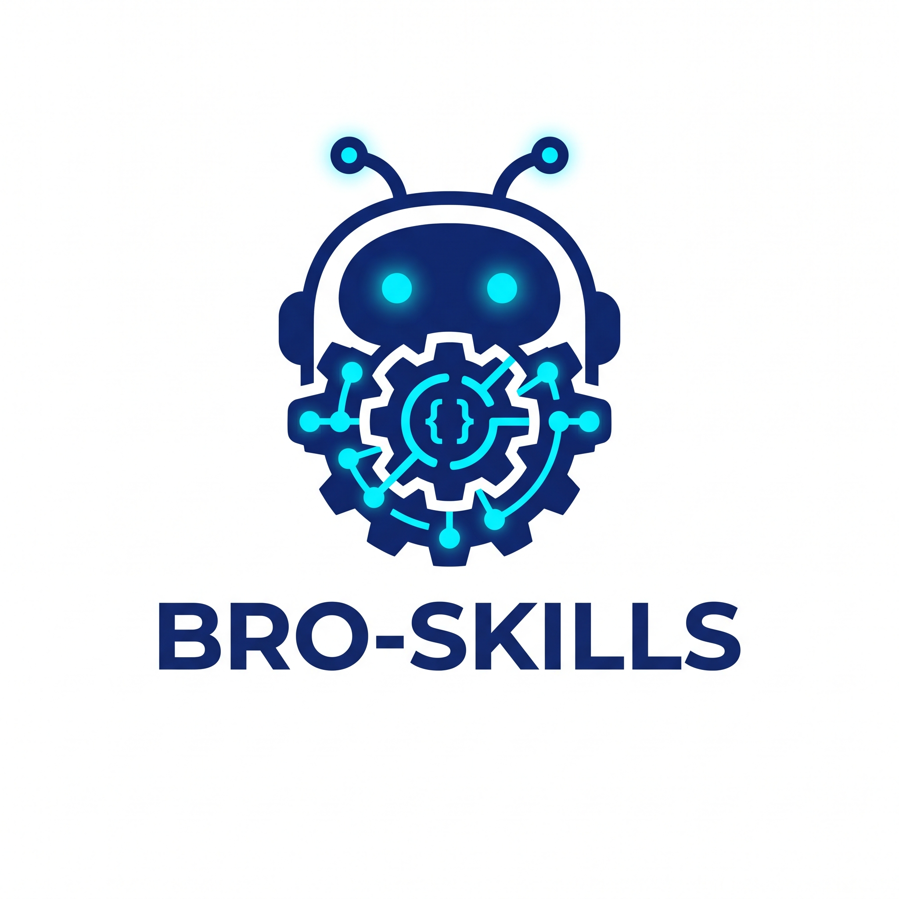

<p align="center">
  
</p>

# ⚡ bro-skills - Spec-Driven Development CLI

> **Python CLI tool** để khởi tạo bất kỳ dự án nào theo tiêu chuẩn Spec-Driven Development (SDD) của Antigravity.

## 🎯 Mục tiêu

Công cụ này tự động tạo cấu trúc `.agent/` tiêu chuẩn cho Antigravity IDE, bao gồm:

- **Skills** (38 skills) — Các năng lực AI tự trị cho từng giai đoạn của SDLC + bộ tạo theo domain (frontend, backend, database, security, mobile/iOS/Android, data, gamedev) và Debug, Backlog, Roadmap, Map, UAT, WordPress, UI/UX Pro Max.
- **Workflows** (33 workflows) — Các lệnh điều phối với điều kiện tiền quyết (pre-conditions), kiểm tra cổng chặn (gate checks), và tiêu chí thành công (success criteria).
- **Templates** — Các mẫu tài liệu Spec, Plan, Tasks, Constitution, Infrastructure, SEO, và tiêu chuẩn **UI/UX Standards**.
- **Scripts** — 4 tiện ích bash (create-feature, setup-plan, check-prerequisites, update-context).

## 📋 Yêu cầu hệ thống

- Python 3.9+ (Windows, Linux, macOS)
- Node.js 16+ nếu bạn muốn chạy bằng `npx`
- Không cần cài đặt thêm thư viện ngoài (chỉ sử dụng thư viện chuẩn của Python)

---

## 📦 Cài đặt / Chạy CLI (Mọi hệ điều hành)

### Cách 1: Chạy bằng `npx` (không cần cài đặt toàn cục)

```bash
# Chạy trực tiếp từ GitHub qua npm/npx
npx github:wedabro/bro-skills version
npx github:wedabro/bro-skills init --target /path/to/project

# Truyền các tham số như CLI thông thường
npx github:wedabro/bro-skills init --name "My Project" --type fullstack

# Sau khi package được publish lên npm registry
npx bro-skills version
npx bro-skills init --target /path/to/project
```

Lưu ý:
- `npx` yêu cầu Node.js/npm và Python 3.9+ phải có sẵn trong PATH.
- Wrapper npm chỉ gọi ngược lại Python CLI gốc, không cài đặt thêm dependency npm riêng biệt.
- Nếu muốn chỉ định cố định Python executable, thiết lập biến môi trường `PYTHON=/path/to/python`.

### Cách 2: `pip install` từ GitHub (Khuyên dùng cho sử dụng lâu dài)

```bash
# Windows / Linux / macOS — Cài đặt toàn cục, lệnh `bro-skills` có thể sử dụng ở mọi nơi
pip install git+https://github.com/wedabro/bro-skills.git

# Kiểm tra
bro-skills version
# → bro-skills v1.4.7
```

### Cách 3: `pipx install` (Cô lập - Không ảnh hưởng đến Python hệ thống)

```bash
# Cài đặt pipx nếu bạn chưa có
pip install pipx
pipx ensurepath

# Cài đặt bro-skills
pipx install git+https://github.com/wedabro/bro-skills.git

# Kiểm tra
bro-skills version
```

### Cách 4: Clone + Cài đặt (Dành cho phát triển)

```bash
git clone https://github.com/wedabro/bro-skills.git
cd bro-skills

# Cài đặt ở chế độ editable (các thay đổi mã nguồn tự động có hiệu lực)
pip install -e .

# Hoặc chạy trực tiếp không cần cài đặt
python ssd.py init
```

### Cách 5: Chạy trực tiếp (Không cài đặt)

```bash
# Clone và chạy trực tiếp
git clone https://github.com/wedabro/bro-skills.git
python bro-skills/ssd.py init --target /path/to/project
```

### Gỡ cài đặt

```bash
pip uninstall bro-skills
# hoặc
pipx uninstall bro-skills
# hoặc nếu đã cài đặt toàn cục bằng npm từ GitHub
npm uninstall -g bro-skills
```

---

## 🚀 Hướng dẫn sử dụng

```bash
# Khởi tạo dự án mới
bro-skills init

# Khởi tạo tại thư mục cụ thể
bro-skills init --target /path/to/project

# Khởi tạo kèm tên dự án
bro-skills init --name "My Awesome Project"

# Khởi tạo ghi đè không cần hỏi lại
bro-skills init --force

# Xem danh sách các skill
bro-skills list-skills

# Xem danh sách các workflow
bro-skills list-workflows

# Xác thực cấu trúc .agent
bro-skills validate --target /path/to/project

# Xem phiên bản
bro-skills version
bro-skills -v

# Cập nhật lên phiên bản mới nhất (tự động phát hiện cài đặt qua pip hoặc npm)
bro-skills update
```

### Lựa chọn nhanh skill/workflow cho AI

| Nhu cầu | Sử dụng workflow/skill |
|---|---|
| Thiết lập luật chơi, tech stack và nguyên tắc bắt buộc cho dự án | `/01-speckit.constitution` |
| Viết spec từ mô tả tự nhiên | `/02-speckit.specify` |
| Làm rõ các yêu cầu mơ hồ trước khi code | `/03-speckit.clarify` |
| Tạo kiến trúc, mô hình dữ liệu, API contracts | `/04-speckit.plan` |
| Chia nhỏ task theo quy tắc 15-Minute Rule | `/05-speckit.tasks` |
| Thực thi code kiểm soát blast radius và testing | `/07-speckit.implement` |
| Review, kiểm tra tĩnh, kiểm thử, xác thực sau khi hoàn thành | `/08-speckit.checker`, `/09-speckit.tester`, `/10-speckit.reviewer`, `/11-speckit.validate` |
| Di chuyển (migrate) dự án có sẵn | `/util-speckit.migrate` |
| Debug lỗi hệ thống, quản lý backlog/roadmap, vẽ bản đồ mã nguồn, UAT | `/speckit.debug`, `/speckit.backlog`, `/speckit.roadmap`, `/speckit.map`, `/speckit.uat` |
| Tối ưu SEO/GEO/Content/UIUX/WordPress cho Web | `/12-speckit.seo`, `/13-speckit.geo`, `/util-speckit.content`, `/util-speckit.uiux`, `/speckit.wordpress` |

---

## 🆕 Quy trình A: Dự án MỚI (Greenfield)

> Dùng khi bạn bắt đầu dự án từ con số 0 — chưa có dòng code nào.

### Bạn cần chuẩn bị những thông tin gì?

| # | Thông tin | Ví dụ | Bắt buộc? |
|---|-----------|-------|-----------|
| 1 | **Tên dự án** | "E-Commerce Platform" | ✅ Có |
| 2 | **Mô tả tính năng** bằng ngôn ngữ tự nhiên | "Hệ thống đặt hàng hải sản trực tuyến..." | ✅ Có |
| 3 | **Tech stack** (ngôn ngữ, framework) | Next.js 15, Python, Go... | ✅ Có (qua bước Constitution) |
| 4 | **Nguyên tắc dự án** (principles) | "Docker-first", "Không hardcode"... | ✅ Có (qua bước Constitution) |
| 5 | **User stories** chi tiết | Kịch bản chi tiết của người dùng | ⚪ Không (AI sẽ tự suy luận) |

### Luồng xử lý (7 bước)

```
Bước 0: Khởi tạo → bro-skills init --name "My Project"
    ↓ Tạo khoảng 90 tệp tin trong thư mục .agent/
    ↓
Bước 1: Thiết lập hiến pháp → /01-speckit.constitution
    ↓ Thiết lập "luật" cho dự án (tech stack, nguyên tắc)
    ↓ ⚠️ KHÔNG ĐƯỢC BỎ QUA — đây là "Neo ngữ cảnh" (Context Anchor)
    ↓
Bước 2: Đặc tả yêu cầu → /02-speckit.specify "Mô tả tính năng bằng tiếng Việt hoặc tiếng Anh"
    ↓ AI tạo spec.md — Chỉ định nghĩa CÁI GÌ (WHAT), KHÔNG định nghĩa LÀM THẾ NÀO (HOW)
    ↓                  Kết quả: Kịch bản người dùng, yêu cầu chức năng, tiêu chí thành công
    ↓
Bước 3: Làm rõ yêu cầu → /03-speckit.clarify
    ↓ AI phát hiện các điểm mơ hồ, hỏi tối đa 3 câu hỏi (bảng lựa chọn A/B/C)
    ↓ Cập nhật lại spec.md sau khi bạn trả lời
    ↓
Bước 4: Thiết lập kế hoạch → /04-speckit.plan
    ↓ AI tạo plan.md — Kiến trúc kỹ thuật của tính năng
    ↓                  Kết quả: data-model.md, contracts/, research.md
    ↓ Cổng kiểm tra: Xác thực mức độ tuân thủ Hiến pháp (Constitution compliance)
    ↓
Bước 5: Chia nhỏ công việc → /05-speckit.tasks
    ↓ AI tạo tasks.md — Danh sách tác vụ nguyên tử (15-Minute Rule)
    ↓                   Định dạng: - [ ] T001 [US1] Mô tả kèm đường dẫn tệp
    ↓ Tổ chức theo User Story, đi kèm sơ đồ phụ thuộc
    ↓
Bước 6: Thực thi → /07-speckit.implement
                   AI thực thi viết code theo tasks.md với 4 giao thức BẤT BIẾN
                   (Blast Radius → Strangler Pattern → TDD → Context Anchoring)
```

### Lệnh rút gọn (Shortcut)

```bash
# Chạy toàn bộ luồng Specify → Clarify → Plan → Tasks → Analyze trong 1 lệnh duy nhất:
/00-speckit.all "Mô tả tính năng..."

# Hoặc chỉ chạy luồng chuẩn bị (không thực thi viết code):
/speckit.prepare "Mô tả tính năng..."
```

### Chi tiết từng bước

#### Bước 0 — `bro-skills init`

```bash
bro-skills init --target /path/to/project --name "My Project"
```

- Tạo cấu trúc `.agent/` (~90 tệp bao gồm: 38 skills, 33 workflows, 7 templates, 4 scripts, identity, knowledge base, constitution, README)
- Mở thư mục dự án trong Antigravity IDE — tác nhân AI sẽ tự động nhận diện thư mục `.agent/`

#### Bước 1 — `/01-speckit.constitution` ⚠️ BẮT BUỘC

- **Đầu vào**: Bạn cung cấp tech stack, nguyên tắc viết code, các điều khoản không thể thương lượng
- **Đầu ra**: `constitution.md` — "Hiến pháp" (Nguồn luật tối cao) cho toàn bộ dự án
- **Tầm quan trọng**: Tất cả các bước sau này sẽ đối chiếu với Hiến pháp để ngăn chặn AI tự suy diễn sai lệch
- **Ví dụ đầu vào**:

  ```
  /01-speckit.constitution
  Tech: Next.js 15, Prisma, PostgreSQL
  Principles:
  1. Docker-first — mọi thứ chạy trong Docker
  2. No hardcode — sử dụng biến môi trường (ENV)
  3. API-first — hoàn thiện API trước, giao diện (frontend) sau
  ```

#### Bước 2 — `/02-speckit.specify`

- **Đầu vào**: Mô tả tính năng bằng ngôn ngữ tự nhiên
- **Đầu ra**: `spec.md` — Đặc tả tính năng (CÁI GÌ, không phải LÀM THẾ NÀO)
- **Tự động hóa của AI**: Trích xuất tác nhân (actors), hành động (actions), dữ liệu (data), ràng buộc (constraints) → Kịch bản người dùng (User stories) → Yêu cầu chức năng → Tiêu chí thành công
- **Ví dụ**:

  ```
  /02-speckit.specify "Xây dựng hệ thống quản lý đơn hàng hải sản
  có giỏ hàng, thanh toán COD/chuyển khoản, và theo dõi đơn hàng"
  ```

#### Bước 3 — `/03-speckit.clarify`

- **Đầu vào**: Không cần — AI tự động đọc `spec.md`
- **Đầu ra**: Bản cập nhật của `spec.md` sau khi làm rõ các điểm mơ hồ
- **Quy trình**:
  1. AI quét spec → phát hiện từ ngữ mơ hồ, thiếu biên giới nghiệp vụ, xử lý lỗi chưa rõ ràng
  2. Phân loại mức độ: 🔴 NGUY CẤP (CRITICAL) / 🟡 QUAN TRỌNG (IMPORTANT) / 🟢 THỨ YẾU (MINOR)
  3. Đặt tối đa 3 câu hỏi NGUY CẤP cho bạn dưới dạng bảng chọn (A/B/C)
  4. Tự động sửa các vấn đề THỨ YẾU

#### Bước 4 — `/04-speckit.plan`

- **Đầu vào**: Không cần — AI đọc `spec.md` + `constitution.md`
- **Đầu ra**: `plan.md`, `data-model.md`, `contracts/`, `research.md`
- **2 Giai đoạn**:
  - Giai đoạn 0 (Nghiên cứu): Giải quyết toàn bộ các phần "CẦN LÀM RÕ" → `research.md`
  - Giai đoạn 1 (Thiết kế): Trích xuất thực thể → Xác định API contracts → `data-model.md`, `contracts/`
- **Kiểm tra cổng**: Kiểm tra xem kế hoạch có vi phạm Hiến pháp hay không → BÁO LỖI nếu vi phạm

#### Bước 5 — `/05-speckit.tasks`

- **Đầu vào**: Không cần — AI đọc `plan.md` + `spec.md`
- **Đầu ra**: `tasks.md` — Danh sách tác vụ nguyên tử, sắp xếp theo thứ tự phụ thuộc
- **Định dạng bắt buộc**:

  ```markdown
  - [ ] T001 Khởi tạo cấu trúc dự án theo kế hoạch thực thi
  - [ ] T005 [P] Triển khai auth middleware trong src/middleware/auth.py
  - [ ] T012 [P] [US1] Tạo User model trong src/models/user.py
  ```

- **Cấu trúc các Giai đoạn**:
  - Giai đoạn 1: Thiết lập cấu trúc (project setup)
  - Giai đoạn 2: Nền tảng (móng dự án, các phần phụ thuộc chặn trên)
  - Giai đoạn 3 trở đi: Mỗi giai đoạn tương ứng với 1 User Story (thứ tự ưu tiên từ spec)
  - Cuối cùng: Đánh bóng & Tối ưu hóa tổng thể

#### Bước 6 — `/07-speckit.implement`

- **Đầu vào**: Không cần — AI đọc `tasks.md` + `plan.md`
- **Quy trình cho MỖI task**:
  1. 🔍 **Phân tích Blast Radius**: Quét các file bị ảnh hưởng → báo cáo mức độ rủi ro
  2. 🏗️ **Chiến lược**: Rủi ro THẤP → sửa trực tiếp, Rủi ro CAO → áp dụng Strangler Pattern (tạo file mới)
  3. 🧪 **TDD**: Tạo script tái hiện lỗi `repro_task_[ID]` → chạy lỗi → viết code sửa → chạy thành công
  4. ✅ **Đánh dấu hoàn thành**: cập nhật trạng thái `- [X] T001 ...` trong `tasks.md`
- **Chống ảo tưởng (Anti-Hallucination)**: Không sử dụng import ảo, so khớp diff chặt chẽ, dừng lại hỏi ý kiến nếu sửa đổi > 3 files

---

## 🔄 Quy trình B: Dự án CÓ SẴN (Legacy Migration)

> Dùng khi bạn đã có mã nguồn từ trước và muốn áp dụng phương pháp SDD cho dự án hiện tại.

### Điểm khác biệt so với Dự án Mới

| Khía cạnh | Dự án MỚI | Dự án CÓ SẴN |
|--------|-----------|--------------|
| Điểm xuất phát | Ý tưởng → viết code | Mã nguồn cũ → tạo đặc tả |
| Bước đặc biệt | `/02-speckit.specify` | `/util-speckit.migrate` |
| Hiến pháp | Thiết lập mới từ đầu | Đảo ngược mã nguồn (Reverse-engineer) |
| Tác vụ (Tasks) | Tạo mới hoàn toàn | Kết hợp: tác vụ di chuyển (migration) + tính năng mới |

### Luồng xử lý (7 bước)

```
Bước 0: Khởi tạo → bro-skills init --target /path/to/existing --name "Legacy Project"
    ↓ Tạo thư mục .agent/ NGAY TRONG dự án hiện tại
    ↓
Bước 1: Thiết lập hiến pháp → /01-speckit.constitution
    ↓ Khai báo tech stack HIỆN TẠI + các nguyên tắc MỚI
    ↓
Bước 2: Di chuyển mã nguồn → /util-speckit.migrate
    ↓ AI quét mã nguồn → đảo ngược để tạo spec và kế hoạch sơ bộ
    ↓                    Kết quả: Danh sách nợ kỹ thuật, đánh giá rủi ro di chuyển
    ↓
Bước 3: Đặc tả yêu cầu → /02-speckit.specify "Tính năng mới cần thêm..."
    ↓ Viết đặc tả cho tính năng MỚI, kế thừa ngữ cảnh từ quá trình di chuyển
    ↓
Bước 4: Kế hoạch → Tác vụ → /04-speckit.plan → /05-speckit.tasks
    ↓
Bước 5: Thực thi → /07-speckit.implement
                   Viết code sử dụng Strangler Pattern — TUYỆT ĐỐI KHÔNG làm hỏng code cũ
```

### Chi tiết bước Di chuyển (Migrate)

** `/util-speckit.migrate` ** thực hiện:

1. **Quét mã nguồn**: Nhận diện ngôn ngữ, framework, cấu trúc thư mục hiện tại
2. **Trích xuất thực thể**: Tìm kiếm data models, routes, endpoints từ code cũ
3. **Đảo ngược đặc tả**: Tạo tệp `spec.md` gốc dựa trên chức năng hiện tại của code
4. **Đánh giá nợ kỹ thuật**: Thống kê danh sách các điểm cần cải thiện/sửa đổi
5. **Đề xuất lộ trình di chuyển**: Thứ tự khuyến nghị để di chuyển các tính năng sang tiêu chuẩn mới

### Ví dụ thực tế

```bash
# 1. Khởi tạo — tạo cấu trúc .agent/ trong thư mục dự án cũ
bro-skills init --target /path/to/dinhchopmonngon --name "DinhChopMonNgon"

# 2. Hiến pháp — khai báo công nghệ hiện hành
/01-speckit.constitution
# → "Next.js 15, Prisma 6, PostgreSQL, Docker-first, Port 8900-8999"

# 3. Di chuyển — AI tự động đọc và phân tích mã nguồn cũ
/util-speckit.migrate
# → AI tạo file spec.md từ chức năng hiện có + báo cáo nợ kỹ thuật

# 4. Thêm tính năng mới trên nền tảng cũ
/02-speckit.specify "Đồng bộ dữ liệu đơn hàng từ API cũ tomhum.com.vn"

# 5. Kế hoạch + Tác vụ + Thực thi
/04-speckit.plan
/05-speckit.tasks
/07-speckit.implement
```

---

## 🛡️ Các giao thức BẤT BIẾN (Áp dụng cho cả hai quy trình)

Mỗi lần AI thực thi viết code, 4 giao thức sau bắt buộc phải được tuân thủ:

| Giao thức | Mục đích | Thời điểm |
|----------|----------|---------|
| **1. Phân tích Blast Radius** | Đánh giá mức độ ảnh hưởng trước khi chỉnh sửa | TRƯỚC khi sửa đổi bất kỳ tệp nào |
| **2. Strangler Pattern** | Tạo tệp mới thay vì chỉnh sửa trực tiếp tệp quan trọng | Khi có > 2 tệp bị ảnh hưởng |
| **3. Viết script tái hiện lỗi trước** | Chứng minh lỗi/tính năng hoạt động trước khi code | TRƯỚC khi thực thi mã nguồn |
| **4. Neo ngữ cảnh (Context Anchoring)** | Định hướng lại cấu trúc dự án | Sau mỗi 3 tác vụ hoàn thành |

---

## 📂 Cấu trúc thư mục .agent/ được tạo ra

```
.agent/
├── identity/                  # Lớp định danh nhân vật AI
│   └── master-identity.md     # Persona, Linh hồn, Năng lực cốt lõi của Agent
│
├── knowledge_base/            # Cơ sở tri thức dự án (tự động điền)
│   ├── infrastructure.md      # Docker, cổng mạng, môi trường
│   ├── data_schema.md         # DB models, các mối quan hệ
│   ├── api_standards.md       # Routes, quy ước thiết kế, auth
│   ├── business_logic.md      # Quy tắc nghiệp vụ, cấu trúc mã nguồn
│   └── seo_standards.md       # Checklist SEO/GEO (chỉ dành cho dự án web)
│
├── skills/                    # Năng lực tác nhân AI (gọi qua ký hiệu @)
│   ├── speckit.identity/      # Kiến trúc sư định danh nhân vật AI
│   ├── speckit.devops/        # Kiến trúc sư Docker & DevOps
│   ├── speckit.analyze/       # Bộ kiểm tra tính nhất quán tài liệu
│   ├── speckit.checker/       # Bộ tổng hợp phân tích tĩnh mã nguồn
│   ├── speckit.checklist/     # Bộ xác thực yêu cầu nghiệp vụ
│   ├── speckit.clarify/       # Bộ làm rõ yêu cầu mơ hồ
│   ├── speckit.constitution/  # Quản trị viên Hiến pháp dự án
│   ├── speckit.diff/          # Bộ so sánh khác biệt các tài liệu đặc tả
│   ├── speckit.implement/     # Bộ thực thi mã nguồn (chống hồi quy lỗi)
│   ├── speckit.migrate/       # Bộ di chuyển dự án cũ
│   ├── speckit.plan/          # Bộ lập kế hoạch kỹ thuật
│   ├── speckit.quizme/        # Bộ thách thức logic (Red Team)
│   ├── speckit.reviewer/      # Bộ duyệt chất lượng mã nguồn (Code Reviewer)
│   ├── speckit.specify/       # Bộ đặc tả yêu cầu nghiệp vụ
│   ├── speckit.status/        # Bảng điều khiển tiến độ dự án
│   ├── speckit.tasks/         # Bộ chia tách công việc thành các tác vụ nguyên tử
│   ├── speckit.taskstoissues/ # Đồng bộ hóa tác vụ lên hệ thống Issue Tracker
│   ├── speckit.tester/        # Bộ chạy thử nghiệm & đo lường độ bao phủ
│   ├── speckit.validate/      # Bộ xác thực mức độ hoàn thiện mã nguồn
│   ├── speckit.frontend/      # Lập trình viên Frontend (builder)
│   ├── speckit.backend/       # Lập trình viên Backend (builder)
│   ├── speckit.database/      # Thiết kế cấu trúc cơ sở dữ liệu (builder)
│   ├── speckit.security/      # Kiểm toán an toàn thông tin (core)
│   ├── speckit.ios/           # Lập trình viên iOS - Swift thuần (builder)
│   ├── speckit.android/       # Lập trình viên Android - Kotlin thuần (builder)
│   ├── speckit.mobile/        # Lập trình viên di động đa nền tảng (builder)
│   ├── speckit.data/          # Kỹ sư dữ liệu & Học máy (builder)
│   ├── speckit.gamedev/       # Lập trình viên Game (builder)
│   ├── speckit.seo/           # Tối ưu hóa công cụ tìm kiếm kỹ thuật (SEO web)
│   ├── speckit.geo/           # Tối ưu hóa tìm kiếm thế hệ mới (AI Search GEO)
│   ├── speckit.content/       # Kiến trúc sư nội dung (web_public)
│   ├── speckit.uiux/          # Kiến trúc sư UI/UX (tiêu chuẩn Pro Max)
│   ├── speckit.debug/         # Bộ dò lỗi và khắc phục sự cố hệ thống
│   ├── speckit.backlog/       # Quản trị viên ý tưởng & việc tồn đọng
│   ├── speckit.roadmap/       # Định hướng lộ trình sản phẩm theo mốc thời gian
│   ├── speckit.map/           # Bộ vẽ sơ đồ kiến trúc mã nguồn
│   ├── speckit.uat/           # Phân tích khoảng cách nghiệm thu người dùng
│   └── speckit.wordpress/     # Lập trình viên WordPress Theme
│
├── workflows/                 # Lệnh điều phối (chạy qua lệnh gạch chéo `/`)
│   ├── 00-speckit.all.md           # Chạy toàn bộ luồng (Specify→Clarify→Plan→Tasks→Analyze)
│   ├── 01-speckit.constitution.md  # Thiết lập hiến pháp dự án
│   ├── speckit.identity.md         # Thiết lập danh tính nhân vật AI
│   ├── speckit.devops.md           # Thiết lập Docker và cấp phát cổng mạng
│   ├── 02-speckit.specify.md       # Đặc tả yêu cầu nghiệp vụ
│   ├── 03-speckit.clarify.md       # Làm rõ yêu cầu mơ hồ
│   ├── 04-speckit.plan.md          # Lập kế hoạch kiến trúc kỹ thuật
│   ├── 05-speckit.tasks.md         # Phân rã tác vụ công việc
│   ├── 06-speckit.analyze.md       # Phân tích tính đồng nhất của hệ thống đặc tả
│   ├── 07-speckit.implement.md     # Thực thi mã nguồn (chống hồi quy lỗi)
│   ├── 08-speckit.checker.md       # Chạy phân tích tĩnh mã nguồn
│   ├── 09-speckit.tester.md        # Chạy kiểm thử tự động
│   ├── 10-speckit.reviewer.md      # Duyệt chất lượng mã nguồn
│   ├── 11-speckit.validate.md      # Xác thực tính năng so với đặc tả gốc
│   ├── 12-speckit.seo.md           # Kiểm toán SEO kỹ thuật
│   ├── 13-speckit.geo.md           # Tối ưu hóa hiển thị trên AI Search (GEO)
│   ├── speckit.prepare.md          # Chạy luồng chuẩn bị (không thực thi viết code)
│   ├── util-speckit.checklist.md   # Tạo và xác thực danh sách yêu cầu nghiệp vụ
│   ├── util-speckit.content.md     # Kiểm toán chất lượng nội dung
│   ├── util-speckit.uiux.md        # Thiết lập hệ thống thiết kế tiêu chuẩn UI/UX Pro Max
│   ├── util-speckit.diff.md        # So sánh sai lệch giữa các tài liệu đặc tả
│   ├── util-speckit.migrate.md     # Di chuyển hệ thống mã nguồn cũ
│   ├── util-speckit.quizme.md      # Đố vui thử thách logic (Red Team)
│   ├── util-speckit.status.md      # Hiển thị bảng điều khiển tiến trình
│   ├── util-speckit.taskstoissues.md # Đồng bộ hóa công việc lên Issue tracker
│   ├── speckit.debug.md            # Thực hiện dò và sửa lỗi hệ thống
│   ├── speckit.backlog.md          # Quản lý công việc tồn đọng và ý tưởng
│   ├── speckit.roadmap.md          # Quản lý lộ trình phát triển sản phẩm
│   ├── speckit.map.md              # Vẽ bản đồ kiến trúc mã nguồn
│   ├── speckit.uat.md              # Phân tích lỗ hổng nghiệm thu người dùng
│   └── speckit.wordpress.md        # Lập trình chủ đề (theme) WordPress
│
├── templates/                 # Mẫu tài liệu tiêu chuẩn
│   ├── spec-template.md       # Mẫu đặc tả yêu cầu nghiệp vụ
│   ├── plan-template.md       # Mẫu kế hoạch kiến trúc kỹ thuật
│   ├── tasks-template.md      # Mẫu phân rã tác vụ công việc
│   ├── constitution-template.md    # Mẫu hiến pháp dự án
│   ├── infrastructure-template.md  # Mẫu thiết lập hạ tầng & Docker
│   ├── seo-standards-template.md   # Mẫu tiêu chuẩn SEO & GEO
│   └── ui-ux-standards-template.md # Mẫu tiêu chuẩn UI/UX Pro Max
│
├── scripts/bash/              # Bộ mã tiện ích chạy bằng Shell Bash
│   ├── create-new-feature.sh  # Tạo nhánh tính năng mới và thư mục đặc tả
│   ├── setup-plan.sh          # Xác định tệp đặc tả trước khi lập kế hoạch
│   ├── check-prerequisites.sh # Xác minh các tài liệu điều kiện cần trước khi thực thi
│   └── update-agent-context.sh # Cập nhật tệp ngữ cảnh cho tác nhân AI
│
├── memory/                    # Bộ nhớ dài hạn của dự án
│   └── constitution.md        # Hiến pháp dự án (Nguồn luật tối cao)
│
├── project.json               # Metadata dự án (loại hình, tên, phiên bản ASF)
└── README.md                  # Hướng dẫn định cấu hình tác nhân AI
```

---

## 🏗️ Kiến trúc Công cụ

```
bro-skills/
├── ssd.py                    # Tệp tương thích ngược (python ssd.py)
├── pyproject.toml            # Cấu hình cài đặt gói Python (PEP 621)
├── README.md                 # Hướng dẫn sử dụng bằng tiếng Anh
├── LICENSE                   # Giấy phép MIT
├── package.json              # Metadata đóng gói npm/npx
├── npm/
│   └── bro-skills.cjs        # Tệp entry point của npx → gọi python -m bro_skills
├── .gitignore
└── bro_skills/                 # Mã nguồn gói Python
    ├── __init__.py            # Khai báo phiên bản: __version__ = "1.4.7"
    ├── __main__.py            # Điểm bắt đầu khi chạy `python -m bro_skills`
    ├── cli.py                 # Điểm bắt đầu của lệnh điều khiển `bro-skills`
    ├── registry.py            # Nguồn sự thật duy nhất — đăng ký 38 skills + 33 workflows + 8 loại dự án
    ├── skill_templates.py     # Định nghĩa cấu hình mẫu cho SKILL.md
    ├── workflow_templates.py  # Định nghĩa cấu hình mẫu cho các Workflow
    ├── templates.py           # Tổng hợp các mẫu tài liệu và tiện ích
    ├── scanner.py             # Quét mã nguồn tự động nhận dạng tech stack, DB, Docker, API
    ├── generator.py           # Engine điều phối chính để khởi tạo thư mục .agent/
    └── validators.py          # Bộ kiểm tra tính hợp lệ với 10 cổng xác thực
```

## 🧪 Hệ thống xác thực (10 cổng kiểm tra)

```bash
bro-skills validate --target /path/to/project
```

| # | Cổng kiểm tra | Mô tả |
|---|-------|-------|
| 1 | Thư mục `.agent/` | Phải tồn tại trong dự án |
| 2 | Thư mục cốt lõi | Phải có đủ: skills/, workflows/, templates/, scripts/, memory/ |
| 3 | Danh sách Skills | Phải chứa đầy đủ 38 thư mục con kèm file SKILL.md |
| 4 | Danh sách Workflows| Phải chứa đủ 33 tệp định dạng `.md` |
| 5 | Danh sách Templates| Phải chứa đủ 7 tệp tài liệu mẫu |
| 6 | Danh sách Scripts | Phải chứa đủ 4 tệp tiện ích bash shell |
| 7 | Hiến pháp | Phải tồn tại `memory/constitution.md` |
| 8 | Hướng dẫn sử dụng | Phải có tệp `.agent/README.md` |
| 9 | Chất lượng nội dung| Dung lượng mỗi tệp `SKILL.md` phải lớn hơn 100 bytes |
| 10| Frontmatter | Mỗi tệp workflow bắt buộc phải khai báo YAML header |

---

## 🌟 Các thông lệ tốt nhất (Best Practices)

1. **❌ Tuyệt đối không phớt lờ Hiến pháp** — Đây là mỏ neo ngữ cảnh quan trọng giữ AI không bị ảo tưởng hoặc lệch hướng thiết kế ban đầu.
2. **🛡️ Phòng thủ chiều sâu** — Mỗi bước đi bắt buộc phải xác thực kết quả của bước trước đó (Specify → Clarify → Plan → Tasks → Analyze).
3. **⏱️ Quy tắc 15 phút** — Mỗi tác vụ được phân tách nhỏ để thực thi tối ưu nhất trong vòng tối đa 15 phút.
4. **🔄 Tinh chỉnh, không làm lại từ đầu** — Phát triển dựa trên các mảnh nhỏ tích lũy tăng dần, tránh việc xóa code viết lại từ đầu.
5. **📊 Viết đặc tả trước khi code** — Làm rõ CÁI GÌ trước, LÀM THẾ NÀO sau. Tài liệu đặc tả nghiệp vụ viết dễ hiểu để các bên liên quan đều có thể cùng đọc và phê duyệt.

---

## Quy trình tích hợp liên tục (CI/CD)

- CI: GitHub Actions tự động chạy `pytest` cho mỗi Pull Request và mỗi lượt đẩy mã nguồn mới.
- Release: Tạo tag phiên bản `vX.Y.Z` để đóng gói thư viện và phát hành GitHub Release với đầy đủ các artifacts tương ứng.

```bash
git tag v1.4.7
git push origin v1.4.7
```

---

## 📄 Giấy phép sử dụng

MIT
